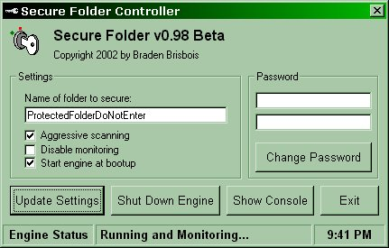



## Secure Folder

### Description

Updated! Denies access to any specified folder. It will close ALL objects that contain the name of folder to secure, and it's parent object, if it's scanning aggressively. I've seen other code attempting to do the same thing here but nothing that is as aggressive as this is. Fully commented!

UPDATED! Fix security holes when editing the registry. When the engine is running, If the controller did not initiate the changes to the password or folder name, then the engine will ignore them and fix the registry entries. This defeats the so called "secure folder nuker" posted here on PSC.

Only known way to defeat it (with engine running and scanning aggressively) is to rename the folder in a DOS box. If anyone knows how to stop this, or finds other security holes, PLEASE LET ME KNOW!!! :)

Also, please be aware that this code will ONLY work on Win98 or Win98SE.
 
### More Info
 
Must be compiled for all functions to work correctly. Place the SEENGINE.EXE under C:\WINDOWS\SYSTEM and place the SECUREFOLDERCONTROLLER.EXE anywhere you want.

Make sure that the name of the folder to protect is unique to anything in your system, or it will close processes that you may not want closed.

             |
---                |---
**Submitted On**   |2002-05-10 20:56:22
**By**             |[Braden](https://github.com/Planet-Source-Code/PSCIndex/blob/master/ByAuthor/braden.md)
**Level**          |Intermediate
**User Rating**    |4.0 (24 globes from 6 users)
**Compatibility**  |VB 5\.0, VB 6\.0
**Category**       |[Complete Applications](https://github.com/Planet-Source-Code/PSCIndex/blob/master/ByCategory/complete-applications__1-27.md)
**World**          |[Visual Basic](https://github.com/Planet-Source-Code/PSCIndex/blob/master/ByWorld/visual-basic.md)
**Archive File**   |[Secure\_Fol818515112002\.zip](https://github.com/Planet-Source-Code/braden-secure-folder__1-34597/archive/master.zip)

